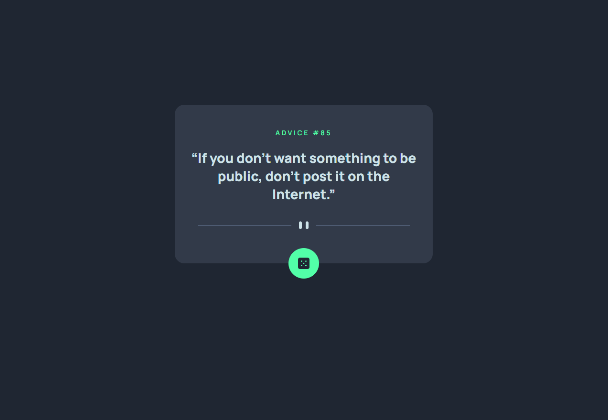

# Frontend Mentor - Advice generator app solution

This is a solution to the [Advice generator app challenge on Frontend Mentor](https://www.frontendmentor.io/challenges/advice-generator-app-QdUG-13db). Frontend Mentor challenges help you improve your coding skills by building realistic projects.

## Table of contents

- [Overview](#overview)
  - [The challenge](#the-challenge)
  - [Screenshot](#screenshot)
  - [Links](#links)
- [My process](#my-process)
  - [Built with](#built-with)
  - [What I learned](#what-i-learned)
  - [Continued development](#continued-development)
  - [Useful resources](#useful-resources)
- [Author](#author)
- [Acknowledgments](#acknowledgments)

**Note: Delete this note and update the table of contents based on what sections you keep.**

## Overview

### The challenge

Users should be able to:

- View the optimal layout for the app depending on their device's screen size
- See hover states for all interactive elements on the page
- Generate a new piece of advice by clicking the dice icon

### Screenshot



### Links

- Solution URL: [https://github.com/Simplify4Me2/advice-generator-app](https://github.com/Simplify4Me2/advice-generator-app)
- Live Site URL: [https://simplify4me2.github.io/advice-generator-app/](https://simplify4me2.github.io/advice-generator-app/)

## My process

### Built with

- Semantic HTML5 markup
- [SASS](https://sass-lang.com/) - CSS with superpowers
- Flexbox
- Mobile-first workflow
- [Vue](https://vuejs.org/) - Progressive JS Framework

### What I learned

This was my first experience using **Vue JS** to build an app. I learned how to work with _templates_, _scoped styling_, pass props to _components_, and emit events. Fetching data from the API felt quite similar to using a hook in React, though the terminology is different—it's called a composable in Vue, not a hook.

This is how I handle the click event in a custom component:

```html
<button @click="$emit('click')">
  
</button>
```

Using separate files for variables and setting font:

```scss
@import './_base.sass' @import './_variables.sass';
```

I've added a reload trigger by updating a ref value. Since the watchEffect will pick up the value change, it will call the same url again:

```js
import { ref, toValue, watchEffect } from 'vue'

export function useFetch<T>(url: string) {
  const data = ref<T | null>(null)
  const error = ref(null)
  const reloadTrigger = ref(0)

  function fetchData() {
    data.value = null
    error.value = null

    fetch(toValue(url))
      .then((res) => res.json())
      .then((json) => {
        data.value = json
      })
      .catch((err) => (error.value = err))
  }

  watchEffect(() => {
    if (reloadTrigger.value >= 0) fetchData()
  })

  function reload() {
    reloadTrigger.value++
  }

  return { data, error, reload }
}

```

### Continued development

Use this section to outline areas that you want to continue focusing on in future projects. These could be concepts you're still not completely comfortable with or techniques you found useful that you want to refine and perfect.

**Note: Delete this note and the content within this section and replace with your own plans for continued development.**

### Useful resources

- [Example resource 1](https://www.example.com) - This helped me for XYZ reason. I really liked this pattern and will use it going forward.
- [Example resource 2](https://www.example.com) - This is an amazing article which helped me finally understand XYZ. I'd recommend it to anyone still learning this concept.

**Note: Delete this note and replace the list above with resources that helped you during the challenge. These could come in handy for anyone viewing your solution or for yourself when you look back on this project in the future.**

## Author

- Website - [Simon Vereecke](https://simplify4me2.github.io/)
- Frontend Mentor - [@Simplify4Me2](https://www.frontendmentor.io/profile/Simplify4Me2)
- Twitter / X - [@simon_vereecke](https://x.com/simon_vereecke)
- GitHub - [@Simplify4Me2](https://github.com/Simplify4Me2)

## Acknowledgments

This is where you can give a hat tip to anyone who helped you out on this project. Perhaps you worked in a team or got some inspiration from someone else's solution. This is the perfect place to give them some credit.

**Note: Delete this note and edit this section's content as necessary. If you completed this challenge by yourself, feel free to delete this section entirely.**
